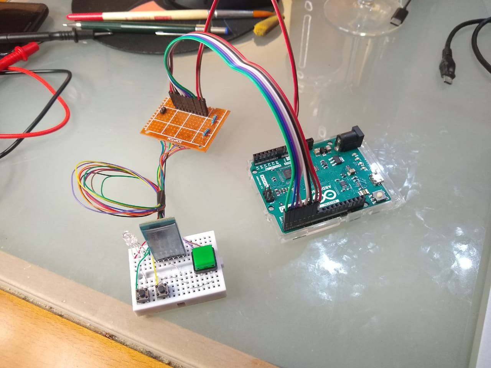
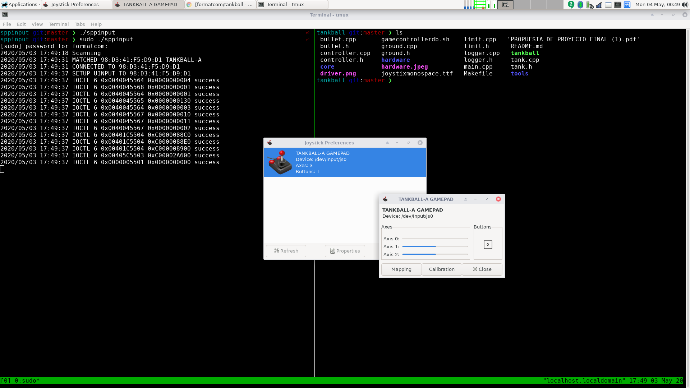

# TANKBALL

~~~
CREDITS & COPYING:
   - joystix monospace.ttf
     REF: https://www.fontspring.com/fonts/typodermic/joystix

   - Box2D
     REF: https://github.com/erincatto/box2d/blob/master/LICENSE

   - SDL2
     REF: https://www.libsdl.org/license.php

   - SDL2_gfx
     REF: https://www.ferzkopp.net/Software/SDL2_gfx/Docs/html/index.html

   - SDL2_ttf
     REF: https://hg.libsdl.org/SDL_ttf/file/b4347abd4fbc/COPYING.txt

   - bluez
     REF: http://www.bluez.org/download/
~~~

### GAME DEPS COMPILER
~~~
   - gcc / c++
   - Box2D
   - SDL2
   - SDL2_gfx
   - SDL2_ttf
~~~

### DRIVER COMPILERCOMPILER
~~~
   - gcc
   - golang
   - bluez-dev
~~~
  
~~~
$ source ./gamecontrollerdb.sh
~~~

### HARDWARE JOYSTICK

### DRIVER JOYSTICK

